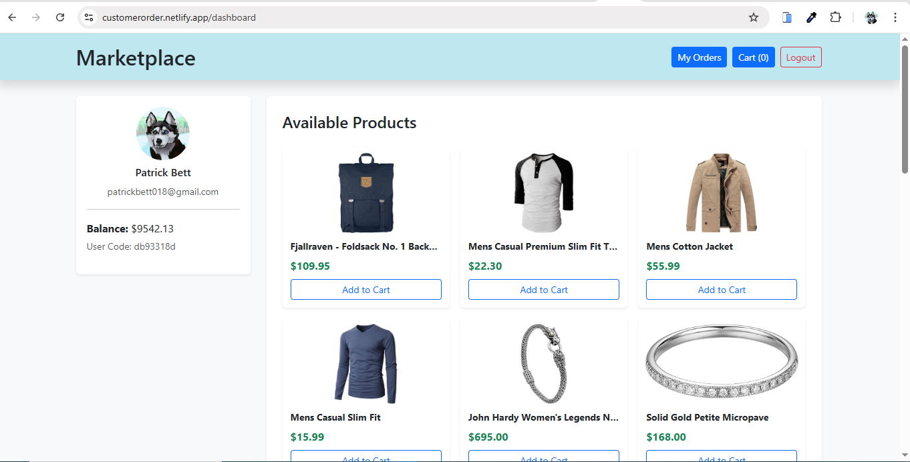
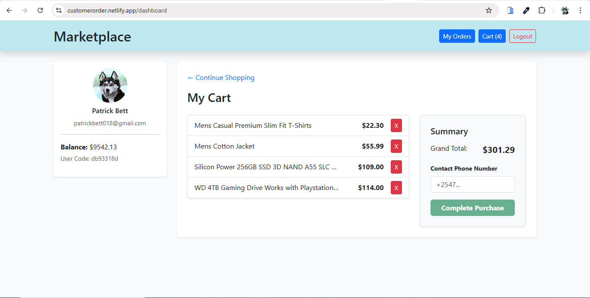
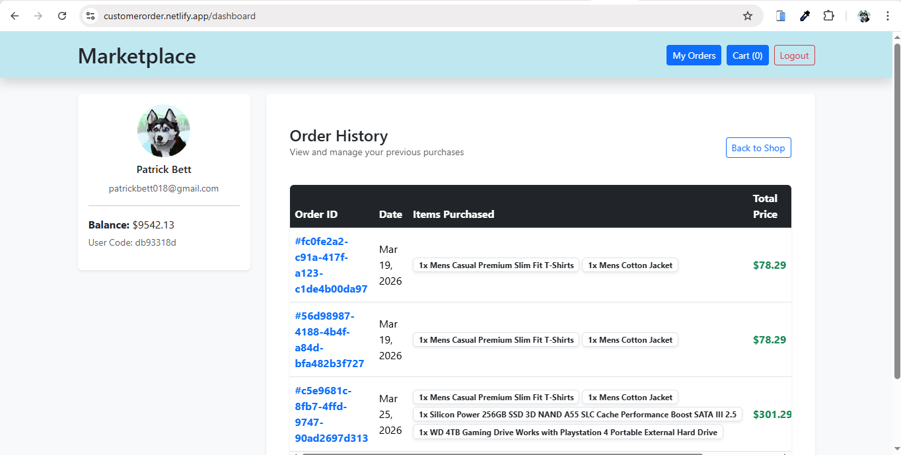

## Getting Started

-   `npm run dev` - Starts a dev server at http://localhost:5173/

-   `npm run build` - Builds for production, emitting to `dist/`

-   `npm run preview` - Starts a server at http://localhost:4173/ to test production build locally

